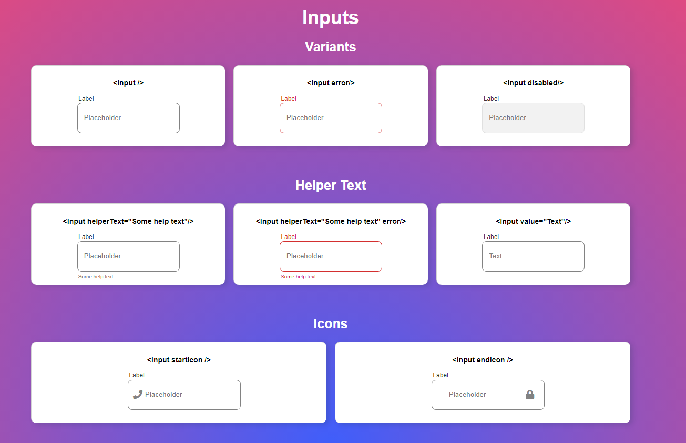

<h1 align="center">ReUsable Button component</h1>

   Solution for a challenge from <a href="http://devchallenges.io" target="_blank">Devchallenges.io</a>.

  <h3>
    <a href="https://maxeemja.github.io/input-component/">
      Demo
    </a>
     | 
    <a href="https://devchallenges.io/solutions/2jRilCouCOtDrlMgf9yY">
      Solution
    </a>
     | 
    <a href="https://devchallenges.io/challenges/TSqutYM4c5WtluM7QzGp">
      Challenge
    </a>
  </h3>

<!-- TABLE OF CONTENTS -->
- [Overview](#overview)
    - [Built With](#built-with)
- [Features](#features)
- [Inspiration](#inspiration)

## Overview
This is a input component which you can test with a demo.

- 2nd Dev Challenges project
### Built With

- HTML
- CSS
- JS/React

## Features
- Reusable input component, error state, icon at start or at end of that.

## Inspiration
This my second tiny project from front-end category. I`m getting better in this deed!.

